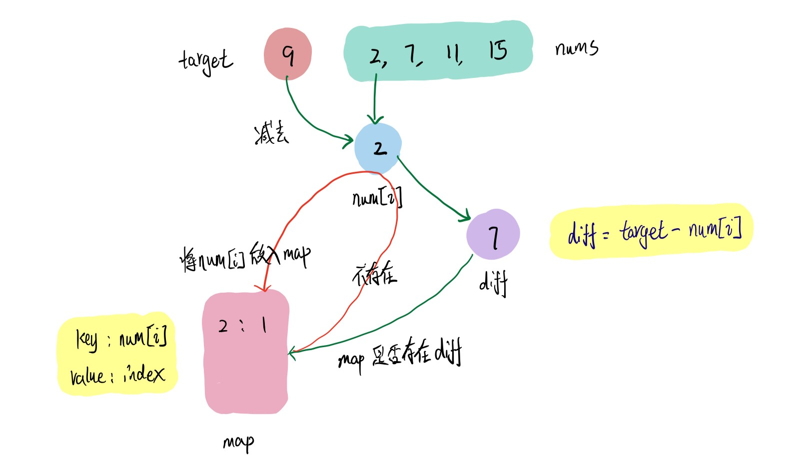

# 0001\_两数之和

## 题目地址

题目链接：[https://leetcode-cn.com/problems/two-sum/](https://leetcode-cn.com/problems/two-sum/)

## 题目解析

### 思路

* 创建哈希表 `map` 存放 nums\[i\] 的值及其索引 index 
* 计算当前 **target - nums\[i\]** 的值 `diff` ，判断 `map` 是否存在 `diff`
* 如果不存在 `diff` 则将当前的 nums\[i\] 存入 `map` 中，如果存在则返回以差值的索引和当前 **i** 组成的数组

### 图解



### 代码

```javascript
var twoSum = function (nums, target) {
  const map = {};

  for (let i = 0; i < nums.length; i++) {
    const diff = target - nums[i];
    if (diff in map) {
      return [map[diff], i];
    }
    map[nums[i]] = i;
  }

  return [];
};
```

## 复杂度分析

* 时间复杂度：O\(N\)，N为数组中元素个数
* 空间复杂度：O\(N\)，N为数组中元素个数

